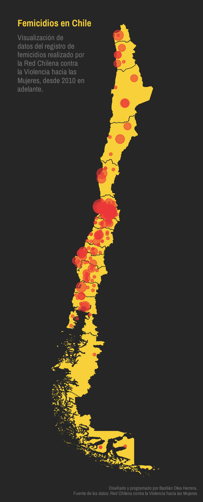
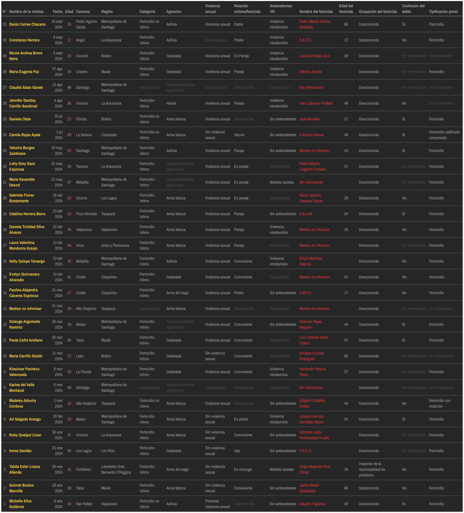
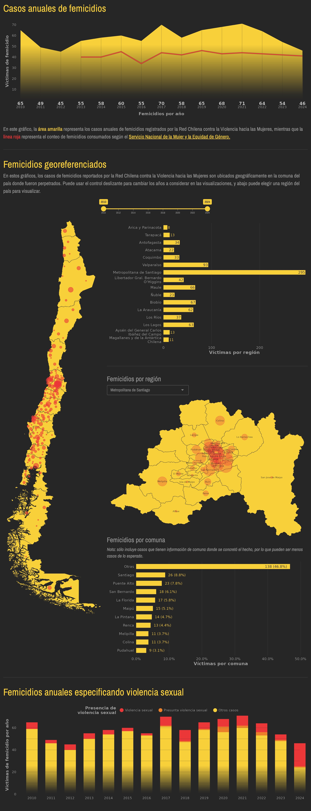
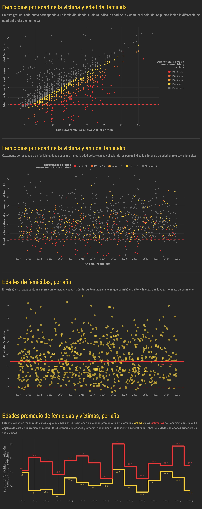
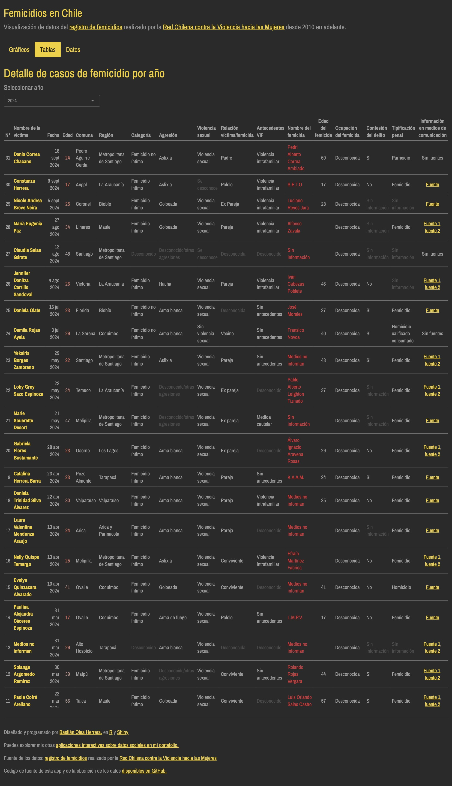

# Femicidios en Chile

[Aplicación web](https://bastianoleah.shinyapps.io/femicidios_chile/) para la visualización de datos del [registro de femicidios](http://www.nomasviolenciacontramujeres.cl/registro-de-femicidios/) realizado por la [Red Chilena contra la Violencia hacia las Mujeres](www.nomasviolenciacontramujeres.cl) desde 2010 en adelante.

Este proyecto incluye scripts de R para descargar todos los datos oficiales recopilados por la Red (obteniendo los enlaces usando web scraping y descargándolos desde Google Docs), limpiarlos, y procesarlos para su visualización, además de la [web app de visualización, desarrollada con Shiny.](https://bastianoleah.shinyapps.io/femicidios_chile/)

La georeferenciación de los datos se basa en la información de localidad o comuna, y cuando no se entrega información de comuna, se aplica la capital regional de la región indicada.

Los datos se encuentran actualizados a octubre de 2024.

Sobre los femicidios, la Red Chilena contra la Violencia hacia las Mujeres plantea:

> La teoría feminista conceptualiza el femicidio como un crimen misógino que refleja, en grado extremo, el sentido de propiedad, dominación y control que ejercen los hombres hacia las mujeres en las sociedades patriarcales.

[Accede a la aplicación web en este enlace](https://bastianoleah.shinyapps.io/femicidios_chile/)

### Datos
- [Femicidios por caso (2010-2024) (Red Chilena contra la Violencia hacia las Mujeres)](datos/femicidios_chile_consolidado.xlsx)
- [Femicidios consumados, por región y año (2010-2024) (Sernameg)](datos/sernameg_femicidios_consumados.xlsx)
- [Femicidios frustrados, por región y año (2010-2024) (Sernameg)](datos/sernameg_femicidios_frustrados.xlsx)

----

## Mapa georeferenciado de femicidios en Chile

## Tabla de femicidios en Chile, año 2024

----

### Notas técnicas
Información sobre los scripts y orden de ejecución.

- `obtener_femicidios.R`: obtiene los datos sobre femicidios en Chile y los descarga desde el sitio de la Red. Obtiene los enlaces con el paquete `{rvest}` haciendo web scraping del sitio de la Red, luego descarga los datos desde Google Docs usando el paquete `{googlesheets4}`. En el caso de la planilla de 2024, se usa el paquete `{googledrive}`, porque esa planilla viene en un formato distinto a las anteriores.
- `procesar_femicidios.R`: en este script se cargan todos los datos obtenidos mediante el web scrapping, y se procesan para dejar en un formato limpio. Se corrigen los nombres, las fechas, las edades, Y la mayoría de las variables categóricas sobre los crímenes son limpiadas y también simplificadas en versiones más breves (con menos niveles o categorías). Finalmente, la mayor parte de este script busca hacer coincidir la información de múltiples variables que indican la ubicación de los hechos delictuales con una lista estandarizada de las comunas del país, de modo que cada femicidio tenga un código de comuna único que permita visualizar los datos geográficamente. Esto resulta particularmente complejo, porque la información geográfica puede encontrarse en distintas columnas dependiendo del año, y la información geográfica no está indicada de manera exacta, sino que contiene ubicaciones poco precisas, mal escritas, con ortografía incorrecta o alternativa, o simplemente no existe información de ubicación pero si existe referencia a lugares en la información de cada caso.
- `obtener_sernameg.R`: script de web scraping de datos "oficiales" de femicidios desde el sitio web del Sernameg (Servicio Nacional de la Mujer y Equidad de Género), que lleva conteos de femicidios consumados y frustrados.

- `app.R`: aplicación Shiny interactiva para la visualización de los datos

- los scripts `mapa_femicidios.R` y `tabla_femicidios.R` generan versiones independientes de las visualizaciones correspondientes en la aplicación.

### Fuentes
- [Red Chilena contra la Violencia hacia las Mujeres](www.nomasviolenciacontramujeres.cl), quienes en su exhaustiva recopilación plantean "esta base de datos es elaborada y administrada por la Red Chilena contra la Violencia hacia las Mujeres. El uso de los datos está a disposición de todas, todos y todes, citando la fuente." Puedes acceder al registro realizado por la Red en [este enlace.](http://www.nomasviolenciacontramujeres.cl/registro-de-femicidios/)
- [Servicio Nacional de la Mujer y Equidad de Género](https://www.sernameg.gob.cl/?page_id=27084)

