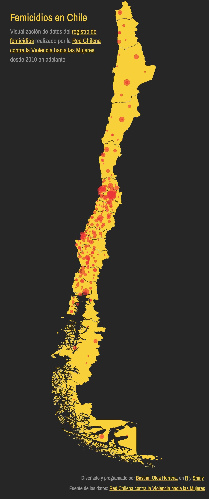
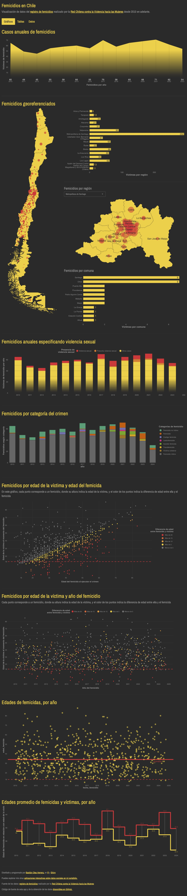
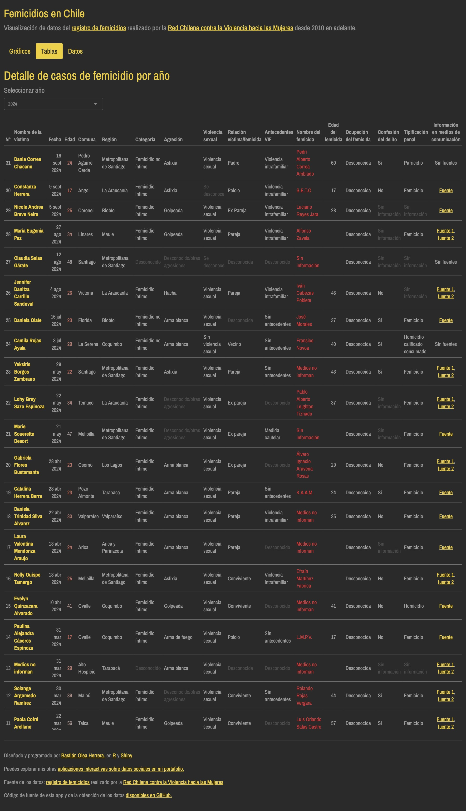

# Femicidios en Chile

[Aplicación web](https://bastianoleah.shinyapps.io/femicidios_chile/) para la visualización de datos del [registro de femicidios](http://www.nomasviolenciacontramujeres.cl/registro-de-femicidios/) realizado por la [Red Chilena contra la Violencia hacia las Mujeres](www.nomasviolenciacontramujeres.cl) desde 2010 en adelante.

Este proyecto incluye scripts de R para descargar todos los datos oficiales recopilados por la Red (obteniendo los enlaces usando web scraping y descargándolos desde Google Docs), limpiarlos, y procesarlos para su visualización, además de la [web app de visualización, desarrollada con Shiny.](https://bastianoleah.shinyapps.io/femicidios_chile/)

La georeferenciación de los datos se basa en la información de localidad o comuna, y cuando no se entrega información de comuna, se aplica la capital regional de la región indicada.

Los datos se encuentran actualizados a octubre de 2024.

Sobre los femicidios, la Red Chilena contra la Violencia hacia las Mujeres plantea:

> La teoría feminista conceptualiza el femicidio como un crimen misógino que refleja, en grado extremo, el sentido de propiedad, dominación y control que ejercen los hombres hacia las mujeres en las sociedades patriarcales.

[Accede a la aplicación web en este enlace](https://bastianoleah.shinyapps.io/femicidios_chile/)

### Fuentes
- [Red Chilena contra la Violencia hacia las Mujeres](www.nomasviolenciacontramujeres.cl), quienes en su exhaustiva recopilación plantean "esta base de datos es elaborada y administrada por la Red Chilena contra la Violencia hacia las Mujeres. El uso de los datos está a disposición de todas, todos y todes, citando la fuente." Puedes acceder al registro realizado por la Red en [este enlace.](http://www.nomasviolenciacontramujeres.cl/registro-de-femicidios/)

